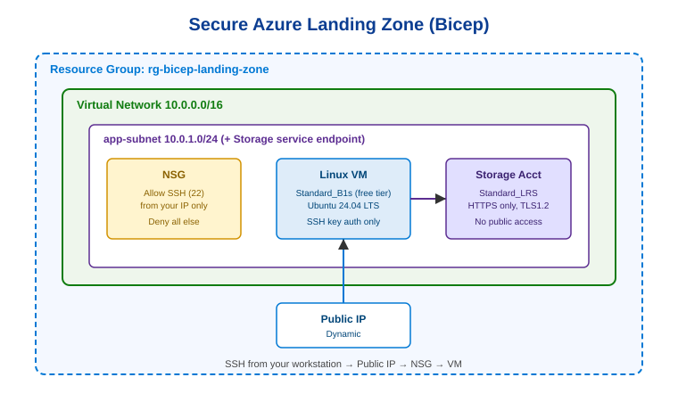

# Secure Azure Landing Zone with Bicep

A small, self-contained Infrastructure-as-Code project that deploys a **secure, free-tier-eligible Azure environment** from a single Bicep template — and tears it all down with one command.

Built to demonstrate the core skills covered by **Microsoft AZ-104 (Azure Administrator)**: networking, storage, compute, identity/governance, and Infrastructure-as-Code.



---

## What it deploys

| Resource | Detail | Why it matters |
|---|---|---|
| **Virtual Network** | `10.0.0.0/16` with an `app-subnet` (`10.0.1.0/24`) | Foundational Azure networking |
| **Network Security Group** | Allows SSH (port 22) **only from your IP**, denies everything else | Least-privilege network access |
| **Storage Account** | `Standard_LRS`, HTTPS-only, TLS 1.2, **no public access**, reachable only from the subnet via a service endpoint | Securing data and network isolation |
| **Linux VM** | `Standard_B1s` (free-tier eligible), Ubuntu 24.04 LTS, **SSH key auth only** | Compute + secure access patterns |
| **Tags** | Consistent tags on every resource (`project`, `environment`, `managedBy`, `costCenter`) | Governance and cost tracking |

Everything lives in **one resource group**, so cleanup is a single command.

---

## Why I built it this way

- **Modular Bicep** — the deployment is split into `network`, `storage`, and `compute` modules rather than one giant file, mirroring how real teams structure IaC.
- **Secure by default** — no passwords (SSH keys only), no public blob access, default-deny networking. Security defaults are an explicit choice, not an afterthought.
- **Repeatable and disposable** — `deploy.sh` and `destroy.sh` mean the whole environment can be stood up and torn down on demand, which keeps costs at £0 and matches real cloud workflows.
- **No secrets in source control** — the real parameters file (with the SSH key) is gitignored; only an example is committed.

---

## Prerequisites

- An Azure account ([free account](https://azure.microsoft.com/free) is plenty)
- [Azure CLI](https://learn.microsoft.com/cli/azure/install-azure-cli) installed
- An SSH key pair (`ssh-keygen -t rsa -b 4096` if you don't have one)

---

## Verify the templates first (recommended)

Before deploying, confirm the Bicep compiles cleanly. The Azure CLI bundles Bicep, so:

```bash
az bicep build --file bicep/main.bicep   # compiles; no errors = good
```

(This generates a `main.json` next to it, which is gitignored.)

---

## How to deploy

```bash
# 1. Log in
az login

# 2. Create your real parameters file from the example
cp bicep/main.parameters.example.json bicep/main.parameters.json

# 3. Edit bicep/main.parameters.json:
#    - paste your SSH public key (contents of ~/.ssh/id_rsa.pub)
#    - optionally set allowedSshSourceCidr to "<your-ip>/32" to lock SSH to just you

# 4. Deploy
chmod +x scripts/deploy.sh scripts/destroy.sh
./scripts/deploy.sh
```

The script validates the template, runs a **what-if** preview so you see exactly what will change, then deploys and prints the VM's public IP.

### Connect to the VM

```bash
ssh azureadmin@<public-ip-from-output>
```

---

## How to tear it down (important!)

```bash
./scripts/destroy.sh
```

This deletes the entire resource group. Always run this when you're done so the free-tier VM hours aren't consumed unnecessarily.

---

## Repo structure

```
.
├── bicep/
│   ├── main.bicep                      # orchestrates the modules
│   ├── main.parameters.example.json    # template params (committed)
│   └── modules/
│       ├── network.bicep               # VNet, subnet, NSG
│       ├── storage.bicep               # locked-down storage account
│       └── compute.bicep               # VM, NIC, public IP
├── scripts/
│   ├── deploy.sh                       # validate + what-if + deploy
│   └── destroy.sh                      # delete everything
├── docs/
│   └── architecture.svg                # diagram above
└── .gitignore
```

---

## What I learned

> _(Fill this in yourself once you've deployed it — it's the most valuable part of the README for recruiters. A few honest sentences about what surprised you, what broke, and how you fixed it is worth more than the code.)_

Some prompts to get you started: How does a service endpoint differ from a private endpoint? Why does default-deny networking matter? What would you change to make this production-ready (e.g. Key Vault for secrets, private endpoints, no public IP)?

---

## Possible next steps

- Swap the public IP + SSH for **Azure Bastion** (no public exposure)
- Store the SSH key / secrets in **Azure Key Vault**
- Add a **GitHub Actions** workflow to deploy on push (CI/CD for infrastructure)
- Convert the storage service endpoint to a **private endpoint**

---

*Built as a portfolio project while studying for AZ-104.*
